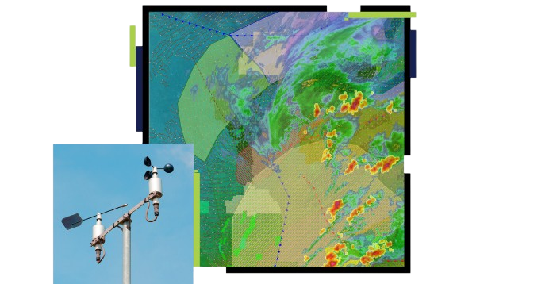

# DataClimate

## Descrição
Este projeto realiza a análise e previsão de tendências climáticas utilizando dados históricos de temperatura, precipitação e umidade. O pipeline de dados inclui extração, transformação, análise exploratória e modelagem preditiva.

## Estrutura do projeto

- **data/**: Contém dados brutos e processados.

- **notebooks/**: Notebooks Jupyter para análise exploratória.

- **src/**: Scripts Python para extração, limpeza, análise e modelagem.

- **models/**: Modelos treinados.

- **requirements.txt**: Dependências do projeto.

## Tecnologias Utilizadas

- **Processamento de Dados**: Python, koalas, pandas, PySpark

- **Armazenamento**: AWS S3 / Local CSV

- **Visualização**: matplotlib, seaborn, Power BI

- **Machine Learning**: scikit-learn, TensorFlow

- **Orquestração**: Apache Airflow

-------------------------------------------------------------------------------------------------

**MIT License ©**
